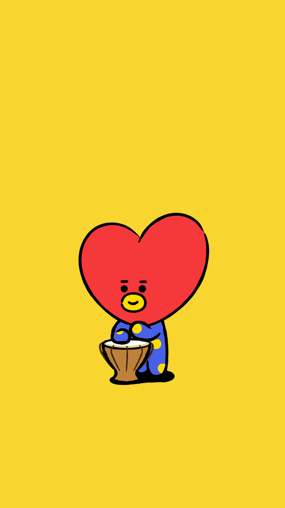
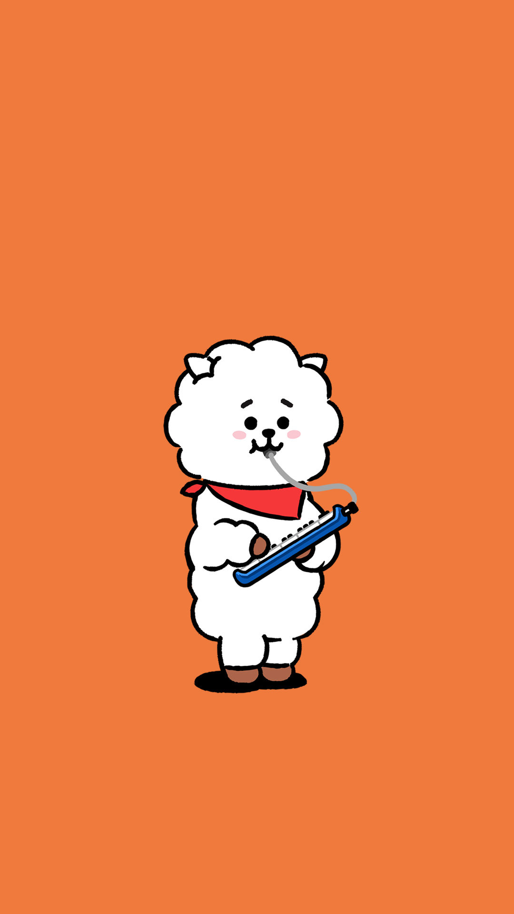
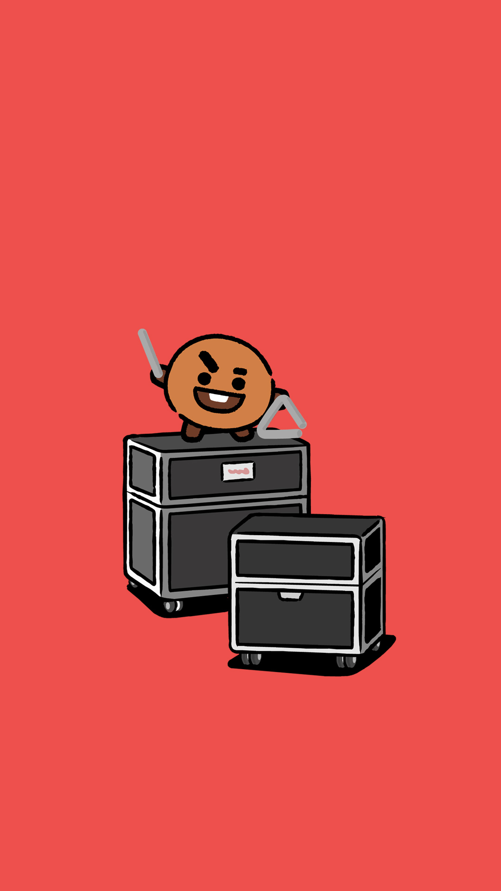
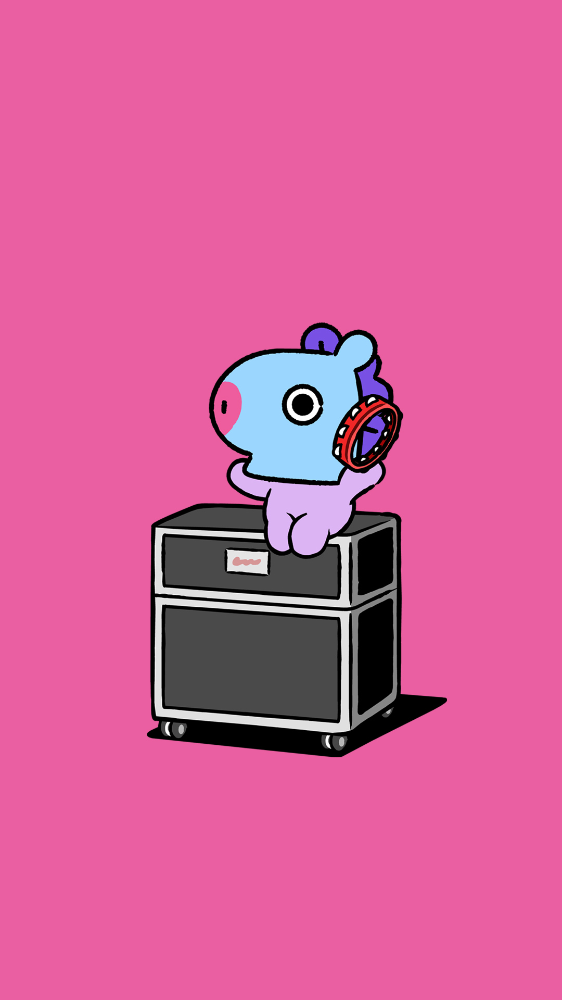
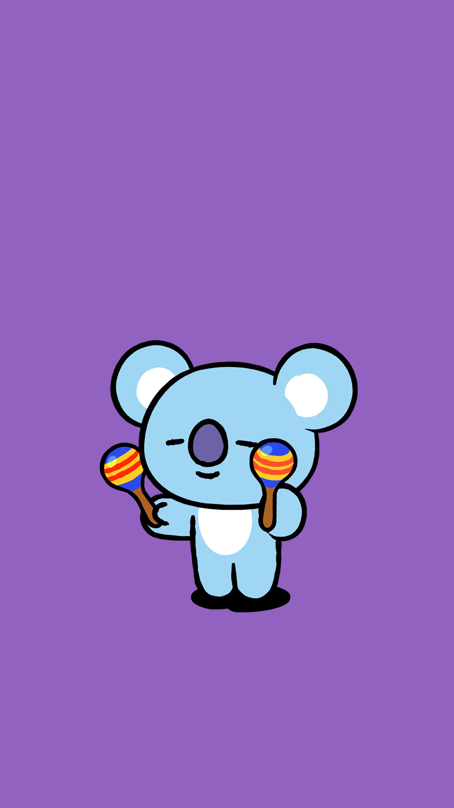
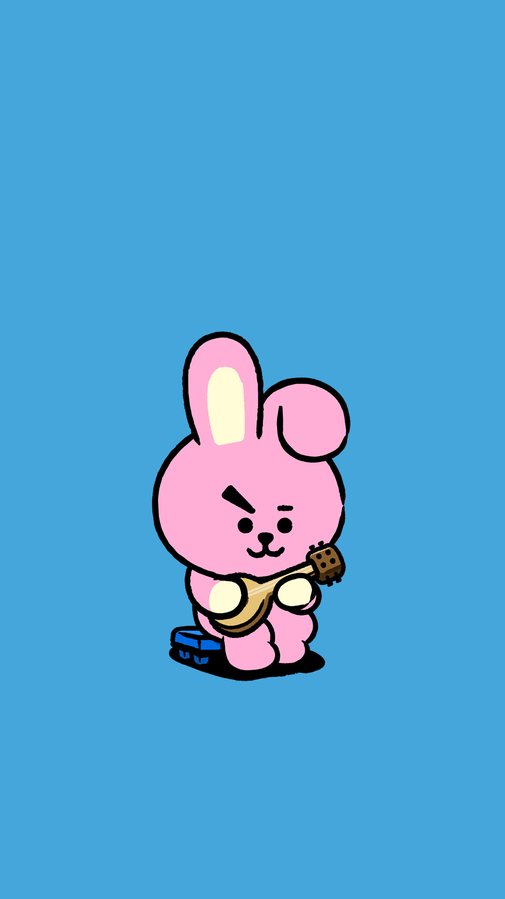
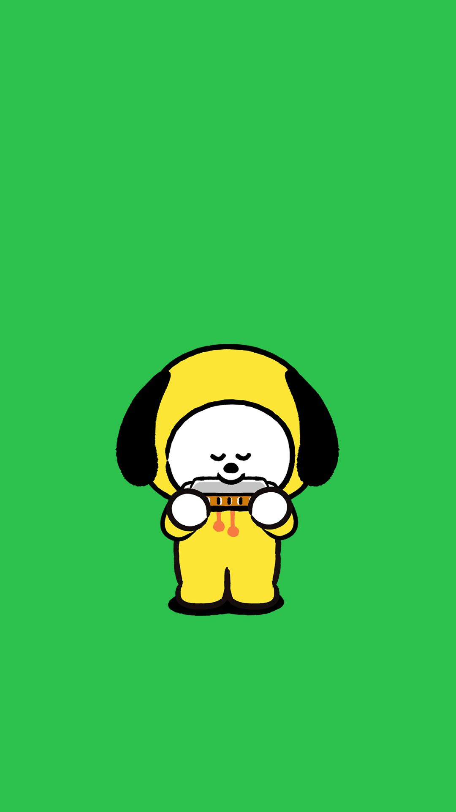
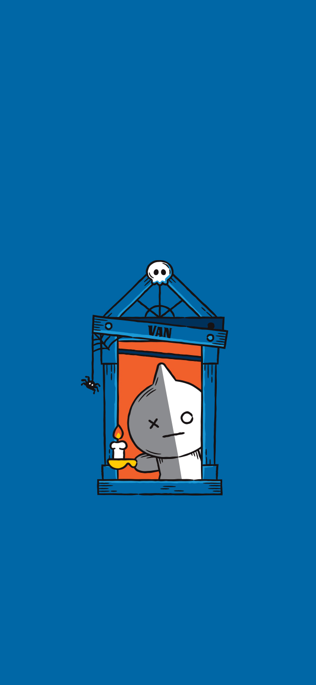
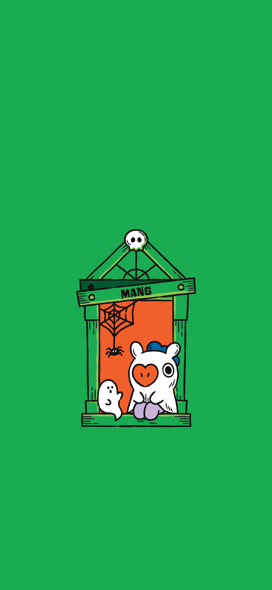

  
<a href="https://zjzsliyang.com/friends/" style="text-decoration: none;">
    
  

    

      

       
      
zjzsly

    
</a>
  

  
<a href="https://yezhisheng.me/" style="text-decoration: none;">
    
  

    

      

       
      
yzs981130

    
</a>
  

  
<a href="https://sxkdz.github.io/" style="text-decoration: none;">
    
  

    

      

       
      
SXKDZ

    
</a>
  

  
<a href="https://www.foxerlee.top/" style="text-decoration: none;">
    
  

    

      

       
      
Foxerlee

    
</a>
  

  
<a href="https://aurora1024.github.io/" style="text-decoration: none;">
    
  

    

      

       
      
Kefei Wu

    
</a>
  

  
<a href="https://ncaylmh.github.io/" style="text-decoration: none;">
    
  

    

      

       
      
Minghao Li

    
</a>
  

  
<a href="https://wayfear.github.io/" style="text-decoration: none;">
    
  

    

      

       
      
Wayfear

    
</a>
  

  
<a href="https://marvinquiet.github.io/" style="text-decoration: none;">
    
  

    

      

       
      
Marvinquiet

    
</a>
  

  
<a href="https://lujiaying.github.io/" style="text-decoration: none;">
    
  

    

      

       
      
Jiaying Lu

    
</a>
  

